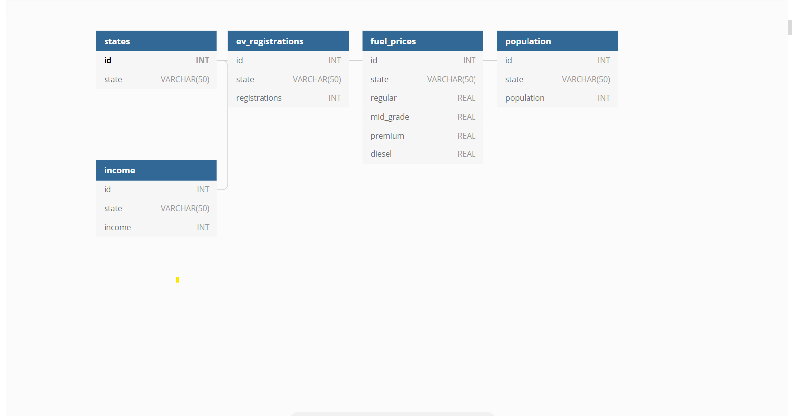

# ETL Project

## Project Proposal

We would like to understand the relationship between fuel price and the proportion of each US State’s privately owned electric cars. Additionally, we would like to find the correlation of the registration of electric vehicles by State, population, and income. Our hypothesis is that gas prices play a large part in influencing vehicle fuel type choice, and because of this, states with higher average fuel prices will also have higher proportions of privately owned electric vehicles making up their privately owned car population.

## Data Sources

* https://afdc.energy.gov/ - Data for electric vehicles registered per State for 2020.

* https://gasprices.aaa.com/state-gas-price-averages/ - The average gas prices per State.

* https://worldpopulationreview.com/states - the population per State for 2020.

* https://worldpopulationreview.com/state-rankings/median-household-income-by-state - The average population income for 2020.

## Extract

We downloaded the CSV files from the sources above and imported into PostgreSQL via jupyter notebook.

## Transform

We built four datasets from four sources of data so we could better explore our question. We used one data source to build our EV analysis dataset. Data extract, transform and load were executed in EV_Registration_By_State_Anlysis Jupyter notebook. Work was done using Python its Pandas library and PostgreSQL.We download the Electric Vehicle Registration Counts by State dataset from the U.S. Department of Energy website (https://afdc.energy.gov). The dataset is in Excel(csv) format. In Jupyter notebook, we used pd.read_csv to read the file and convert them into Panda DataFrame called "ev_df", "fuel_prices", “population” and “income” displays 50 states and their privately owned EV count in 2020. This dataset had headers, footers and charts which were not relevant to our analysis. To get the specific information we were interested in without the headers and footers, we passed skip rows and skip footer to pd.read_excel in order to exclude this information.We used a similar approach for the “fuel_prices”, “population” and “income” csv files. An id was created for each table that would match with their States so that we can pull data accurately from the tables after joining them.

## Load

We created a database in PostgreSQL and created tables using 'id' as a primary key. We used 'id' as a primary key to prevent duplicate values and to prevent any additional information from being added without running into any issues. We used jupyter notebook's SQL Alchemy to import all the data from our CSV files into PostgreSQL.

